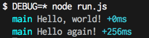
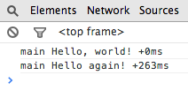

[Debug](https://github.com/visionmedia/debug) is a small library for logging debug messages. Since it is just a wrapper around `console.log`, it works in both Node and the Browser. It allows you to filter logging output without changing your source and it also outputs time differences which lets you easily tell how much time has elapsed between log messages.

## Log The Things

To log messages using debug, first create a logger:

```js
var Debug = require('debug');
var debug = Debug('main');
```

`require('debug')` gets you the debug module - which is a function, I will call that capitalized `Debug`. Calling `Debug` with a name gives you a logger - which is also a function - we will call that lowercase `debug`. Now you can use it to log messages:

```js
debug('Hello, world!');
setTimeout(
debug('Hello again!');
```

## Seeing The Logs

If you save the above example as `run.js` and run it with Node:

```
$ node run.js
```

Nothing happens. *Don't panic!* It's just that debug hides messages by default. You need to configure the logger to output messages from the logger(s) you want to see. For now we'll set visibility to *everything* by setting the `DEBUG` environment variable to `*`.



Sweet! Notice that the output contains the logger name, the message, and the time difference between the current and previous log messages. Oh, and nice colored text output too.

In the browser, configuration is done via the `Debug.enable()` method, like so:

```js
Debug.enable('*');
```



The configuration setting is persisted across browser refreshes via localStorage, which is convinient for debugging.

`<side-note>` Okay, this may be one of the very few times where something looks better in the terminal than it does it the browser. *What?!!* Though I was told that on some browsers at least, you can now style console.log output - [pull request](https://github.com/visionmedia/debug) anyone? `</side-note>`

Now lets look at different ways you can filter the log messages.

## Filtering The Logs

The wildcard `*` is what to do if you want to see all the log messages going through debug, but debug is more useful when you want to filter down debug messages to specific modules you are having trouble with. So let's say you have a calculator module that looks like this (`calculator.js`):

```js
module.exports = {
  add: function(one, other){
    return one + other;
  }
}
```

With the debug module, we can instrument it with debug statements like this:

```js
var debug = require('debug')('calculator');

module.exports = {
  add: function(one, other){
    debug('Adding numbers:', one, other);
    var result = one + other;
    debug('Result:', result);
    return result;
  }
}
```

Then you have a `main.js` script that uses `calculator.js`:

```js
var debug = require('debug')('main');
var calc = require('./calculator');

var num1 = prompt('First number');
var num2 = prompt('Second number');
var result = calc.add(num1, num2)
debug('result:', result);
alert('Result is ' + result);
```

We have a bug somewhere. Let say that we suspect the problem to be in `calculator.js`, we can just turn on debug logging for it in the JS console:

```js
> Debug.enable('calculator')
```

Now rerun the code and you shall see the log messages for `calculator.js`. 

To see output for more than just one module, i.e. both `main.js` and `calculator.js`, use a comma to separate them:

```js
> Debug.enable('calculator,main')
```

Debugging this code is left as an exercise for the reader ;)

## Wildcards

You can use the wildcard `*` to pattern match module names - this is useful for modules that have submodules. For example, maybe your calculator module got complicated and you split the code into `calculator/add.js` and `calculator/multiply.js`. As a simple convention, both files can use the same prefix for their logger names:

```js
// in calculator/add.js
var debug = require('debug')('calculator:add');

// in calculator/multiply.js
var debug = require('debug')('calculator:multiply');
```

Now, if you want to see only messages for `add.js`, you can specify the specific logger as

```js
> Debug.enable('calculator:add')
```

But, if you want to see the messages for either submodule, you can simply configure it using a wildcard

```js
> Debug.enable('calculator:*')
```

## Bye!

To learn more about debug, check out the [readme](https://github.com/visionmedia/debug), or just [read the source](https://github.com/visionmedia/debug/blob/master/debug.js), cause seriously it's tiny.


