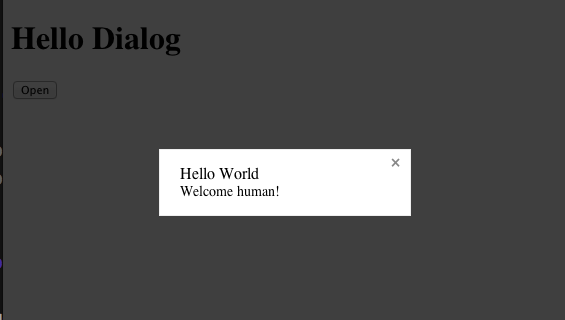

Hello, and welcome to the first post of Small.js! This post will cover the basics of [Component](https://github.com/component/component). Component is a frontend Javascript package manager developed by the prolific Tj Holowaychuk. It embodies the philosophy of small modules and is designed to manage assets as well as Javascript. Currently, there exists over 1600 "components". Although there are more popular JS package managers than Component, I chose to cover it first because I *love* an underdog.

**Update: There is a [screencast](#screencast) for this post as well for those who prefer watching over reading.**

## Installing

Before getting started, you'll need to install [Node](http://nodejs.org) - which is a prerequisite of Component. Installing Node is as simple as clicking on "Download" on the Node website, and then running the installer. To verify you have successfully installed Node, run `node` from the command line and see that the executable exists.

Next, install Component using npm (sudo is required on some platforms)

    npm install component -g

Component is installed! If you type `component` you should see its usage info
    
  Usage: component <command> [options]

  Options:

    -h, --help     output usage information
    -V, --version  output the version number

  Commands:

    install [name ...]      install one or more components
    create [dir]            create a component skeleton
    search [query]          search with the given query
    convert <file ...>      convert html files to js modules
    info <name> [prop]      output json component information
    changes <name>          output changelog contents
    wiki                    open the components list wiki page
    build                   build the component
    ls                      list installed components

Component has several commands. For this tutorial we'll cover only `install`, and `build`.

## Create a Project

To create an application which uses components, all that's required is that the root directory of the project contains a valid `component.json` file. So let's set these up

    mkdir hello_component
    cd hello_component

Next, create a file `component.json` with the following content

    {
      "name": "hello_component"
    }

Congratulations! Now, we can start installing components.

## Installing a Component

For demostration purposes, we'll install the [dialog component](https://github.com/component/dialog):

    component install component/dialog

`component/dialog` is simply an alias to the Github url: `https://github.com/component/dialog`. All components are identified by their Github URL. Once you've installed dialog, you'll notice that a `components` directory was created, and that it contains a `component-dialog` subdirectory plus a bunch of others

    $ ls components
    component-classes          component-indexof
    component-css              component-matches-selector
    component-delegate         component-overlay
    component-dialog           component-query
    component-dom              component-sort
    component-domify           component-type
    component-emitter          component-value
    component-event

All the other components that were installed were installed because they are either a direct dependency or a transitive dependency of `component/dialog`.

Also note that your `component.json` has been doctored - a "dependencies" field has been added containing `component/dialog`

    "dependencies": {
      "component/dialog": "*"
    }

keeping the dependencies in `component.json` allows you to easily get back all the components you need even if you've deleted the `components` directory, via the command: `component install`.

Next, to test out the dialog, we need to build it.

## Build It

In order to consume any components, you will need build them - which combines all of the components you've currently installed into a .js file and a .css file. Why CSS? Because components can contain CSS - dialog does.

    component build

Now you should see a `build` directory which contains a `build.js` as well as a `build.css`.

## Test It

The only other thing we need to do now is to create a test page that links these files

    <!doctype html>
    <html>
    <head>
      <title>Hello Dialog</title>
      <link href="build/build.css" rel="stylesheet">
      
    </head>
    <body>
      <h1>Hello Dialog</h1>
    </body>
    </html>

Sweet! Open it up in your browser, but nothing happens. Oops, we still need to write some Javascript. First let's bring in the dialog component using the `require` function

    var Dialog = require('dialog');

Then make an `openDialog` function which calls the dialog component API

    function openDialog(){
      var dialog = new Dialog('Hello World', 'Welcome human!')
        .closable() // this adds an `x` button on the top right
        .modal()    // makes it a modal dialog

      dialog.show()
    }

To activate this function, put a button on a page, and *just for now*, use an onclick attribute

    <button id="button" onclick="openDialog()">Open</button>

Refresh the page, click the button you should see a modal dialog!

[Full Source](https://github.com/airportyh/hello_component/blob/master/example1.html)

## Do Some DOM

Using the `onclick` attribute is ok for a quick toy example, but would be unsanitary for a real app, so let's rewrite that in a cleaner way. jQuery time, right? *Not so fast!* In the land of Component, instead of jQuery, we can use the much more light-weight [dom component](https://github.com/component/dom)

    component install component/dom

Check your `component.json` and make sure it contains "component/dom" as a dependency. There's currently a [bug](https://github.com/component/component/issues/465) in Component that causes a dependency not to get added if it already exists in the `components` directory. If it's not there, just add it manually - so we should have

    "dependencies": {
        "component/dialog": "*",
        "component/dom": "*"
    }

rebuild the components

    component build

Now, we can do this

    var dom = require('dom');
    ...
    dom('#button').on('click', openDialog);

Same result, but cleaner code! Very jQuery-like, no?

[Full Source](https://github.com/airportyh/hello_component/blob/master/example2.html)

## Finding Components

How to know what components exist? You can peruse the [components wiki page](https://github.com/component/component/wiki/Components) - which in fact *is* the official registry for components. Alternatively you can also use the `component search` command, for example

    component search dom

to search for all dom-related components.

## Homework

What's that? *Ohhhh yes!* Of course there's homework! Don't look so surprised. What? *Yes*, you have to do it. If you don't, everything you've learned thus far will be lost.

Your homework is to browse the [registry](https://github.com/component/component/wiki/Components) and pick one that looks interesting to you. Then, you are going to install it and incorporate it into your code. Good luck!

## Screencast

<iframe src="//player.vimeo.com/video/86336598" width="500" height="281" frameborder="0" webkitallowfullscreen mozallowfullscreen allowfullscreen></iframe> 
<a href="http://vimeo.com/86336598">Component Part 1</a> from <a href="http://vimeo.com/user1147567">Toby Ho</a> on <a href="https://vimeo.com">Vimeo</a>.

